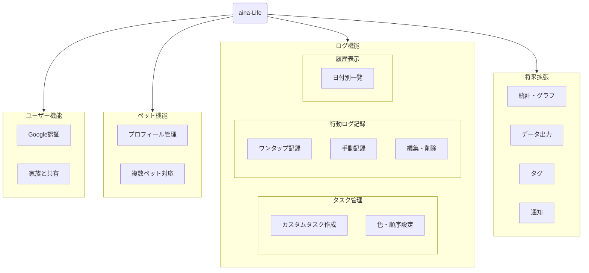

# aina-Life 総合ドキュメント

---

## 1. プロジェクト概要

aina-Lifeは、犬の1日の行動を簡単に記録・管理し、複数ユーザーでの共有を可能にするライフログアプリケーションです。ワンタップ記録、ログの閲覧・管理、複数ペット対応、Google認証などを主要機能としています。

React + Firebaseでの実装方法を具体化し、開発の全体像、原則、計画をこのドキュメントで一元管理します。

---

## 2. アプリケーション要件

### 2.1. 機能一覧



### 2.2. ユーザー要件
- Googleログインによる認証機能。
- 複数ユーザーで同じペットのログを共有できること。

### 2.3. ペットプロフィール要件
- 複数のペットを登録・管理できること。
- ペットごとに詳細なプロフィール情報（名前、犬種、誕生日、性別、お迎え日、健康メモなど）を記録できること。

### 2.4. タスク要件
- ログ記録に使うタスクをユーザーが自由に作成・編集・削除できること。
- タスクごとに色や表示順を設定できること。

### 2.5. ログ記録・表示要件
- ボタンのワンタップで現在時刻のログを記録できること。
- 時刻やメモを指定して手動でログを記録できること。
- 記録したログは編集・削除が可能であること。
- 日付を切り替えて過去のログを一覧表示できること。

### 2.6. オフライン要件
- オフライン（圏外）でもログ記録が可能で、接続回復時に自動で同期されること。

---

## 3. データモデル (Firestore)

### 3.1. users コレクション

```json
users/{userId} {
  authName: string,
  authEmail: string,
  nickname: string,
  birthday: string,        // ユーザーの誕生日
  gender: string,          // ユーザーの性別
  profileImageUrl: string, // プロフィール画像のURL
  introduction: string,    // 自己紹介文
  primaryPetId: string,    // デフォルト表示するペットのID
  settings: {              // アプリ設定
    theme: "light" | "dark" | "system",
    notifications: {
      dailySummary: boolean
    }
  },
  createdAt: Timestamp,
  updatedAt: Timestamp
}
```

### 3.2. dogs コレクション
> `ownerIds` は共有機能実装までの暫定的なフィールド。将来的には `members` サブコレクションに完全に移行する。
```json
dogs/{dogId} {
  name: string,
  breed: string,
  birthday: string,
  gender: string,            // ペットの性別
  profileImageUrl: string,   // プロフィール画像のURL
  adoptionDate: string,      // 家族に迎えた日
  microchipId: string,       // マイクロチップID
  medicalNotes: string,      // 健康に関するメモ
  vetInfo: {                 // かかりつけ動物病院
    name: string,
    phone: string
  },
  ownerIds: array<string>,
  createdBy: userId,
  updatedBy: userId,
  createdAt: Timestamp,
  updatedAt: Timestamp
}
```

### 3.3. weights サブコレクション
ペットの体重履歴を時系列で記録します。
```json
dogs/{dogId}/weights/{weightId} {
  value: number,      // 体重の値
  unit: "kg" | "lb",  // 単位
  date: Timestamp     // 記録日
}
```

### 3.4. members サブコレクション
```json
dogs/{dogId}/members/{userId} {
  role: "owner" | "general" | "viewer",
  invitedBy: userId,
  invitedAt: Timestamp,
  status: "pending" | "active" | "removed",
  inviteEmail: string,
  createdAt: Timestamp,
  updatedAt: Timestamp
}
```

### 3.5. tasks サブコレクション
```json
dogs/{dogId}/tasks/{taskId} {
  name: string,
  color: string, // タスクの背景色 (例: "#FF0000")
  textColor: string, // 背景色に対して可読性の高い文字色 (例: "#FFFFFF")
  order: number,
  createdBy: userId,
  updatedBy: userId,
  createdAt: Timestamp,
  updatedAt: Timestamp
}
```

### 3.6. logs サブコレクション

```json
dogs/{dogId}/logs/{logId} {
  taskName: string,
  taskId: string,
  timestamp: Timestamp,
  note: string,
  inputType: "auto" | "manual",
  createdBy: userId,
  updatedBy: userId,
  createdAt: Timestamp,
  updatedAt: Timestamp
}
```

---

## 4. 画面設計

### 4.1. 画面構成

| 画面 | URL | 内容 |
|:---|:---|:---|
| ログイン | /login | Googleログイン |
| ホーム | / | タスクボタン一覧、押下でログ記録、手入力フォーム |
| 履歴 | /history | 日付切替、ログ一覧、編集・削除 |
| タスク | /tasks | タスク追加・編集・削除、順序変更 |
| ペット | /pets | ペット一覧表示、追加・編集・削除 |
| 設定 | /settings | ユーザー情報表示、ペットの共有管理、ログアウト |

### 4.2. ホーム画面 設計詳細

**URLパス:** `/`

**目的:** 選択中のペットの行動を、ワンタップまたは簡単な手入力で素早く記録し、当日のログを時系列で確認する。

---

#### レイアウト・コンポーネント

*   **ヘッダー (`<Header />`)**
    *   **左側:** 現在選択中のペットの名前とアイコン画像を表示 (`<CurrentPetDisplay />`)
    *   **右側:** 設定画面へ遷移する歯車アイコン (`<SettingsIcon />`)
*   **メインコンテンツ (`<Main>`)**
    *   **タスクボタンエリア (`<TaskSelector />`):** 登録済みのタスクをボタンとして横一列に表示する。
    *   **今日のログタイムライン (`<LogTimeline />`):** 本日のログを時系列（降順）で表示する。
    *   **フローティングアクションボタン (`<QuickAddButton />`):** 手動入力フォームをモーダルで表示するためのトリガー。
*   **手動入力モーダル (`<ManualAddLogModal />`):** 過去の時刻のログや、メモ付きのログを記録する。
*   **フッターナビゲーション (`<FooterNav />`)**

### 4.3. 履歴画面 設計詳細

**URLパス:** `/history`

**目的:** 日付を切り替えながら、過去のログを一覧で確認・管理（編集/削除）する。

---

#### レイアウト・コンポーネント

*   **ヘッダー (`<Header />`)**
*   **メインコンテンツ (`<Main>`)**
    *   **日付スイッチャー (`<DateSwitcher />`):** 表示するログの日付を選択する。
    *   **ログ一覧 (`<LogList />`):** 選択された日付のログを時系列（降順）で表示する。
*   **フッターナビゲーション (`<FooterNav />`)**

### 4.4. タスク画面 設計詳細

**URLパス:** `/tasks`

**目的:** ログ記録に使用するタスクの種類、色、表示順をユーザーが自由にカスタマイズできるようにする。

---

#### レイアウト・コンポーネント

*   **ヘッダー (`<Header />`)**
*   **メインコンテンツ (`<Main>`)**
    *   **タスク一覧 (`<TaskList />`):** 登録済みの全タスクをリスト形式で表示・管理する。
*   **タスク編集/追加モーダル (`<TaskEditModal />`):** タスクの新規作成と既存タスクの編集を行う。

### 4.5. ペット画面 設計詳細

**URLパス:** `/pets`

**目的:** ユーザーが所有するペットの情報を網羅的に管理し、健康管理（特に体重）の履歴もここで行う。

---

#### レイアウト・コンポーネント

*   **ヘッダー (`<Header />`)**
*   **メインコンテンツ (`<Main>`)**
    *   **ペット切り替えタブ (`<PetSwitcherTabs />`):** 登録されているペットを切り替えて表示する。
    *   **プロフィールカード (`<ProfileCard />`):** 選択中ペットの詳細情報を表示する。
    *   **体重管理エリア (`<WeightManagement />`):** 体重の履歴を可視化し、新しい記録を追加する。
    *   **アクションボタンエリア (`<ActionButtons />`):** プロフィール編集や共有設定を行う。
*   **各種モーダル:**
    *   **プロフィール編集/追加モーダル (`<PetEditModal />`)**
    *   **体重記録モーダル (`<WeightLogModal />`)**
    *   **家族共有モーダル (`<FamilyShareModal />`)**
*   **フッターナビゲーション (`<FooterNav />`)**

### 4.6. 設定画面 設計詳細

**URLパス:** `/settings`

**目的:** アカウント情報の確認、ペットの共有管理、招待の承認など、アプリケーション全体に関わる設定を行う。

---

#### レイアウト・コンポーネント

*   **ヘッダー (`<Header />`)**: 全画面共通のヘッダー。

*   **メインコンテンツ (`<Main>`)**:
    *   **1. 保留中の招待エリア (`<PendingInvitations />`)**
        *   **役割:** 他のユーザーから共有招待が来ているペットを表示し、承認または拒否を行えるようにする。
        *   **UI:** 招待ごとにペット名を表示し、「承諾」「拒否」ボタンを設置する。招待がない場合はメッセージを表示。

    *   **2. ユーザー情報エリア (`<UserInfo />`)**
        *   **役割:** 現在ログインしているユーザーの基本情報を表示する。
        *   **UI:** カード形式でユーザーの名前とメールアドレスを表示する。（注: プロフィール編集機能は今後の実装計画）

    *   **3. ペット共有管理エリア (`<PetSharingManagement />`)**
        *   **役割:** ヘッダーで選択中のペットについて、共有メンバーの管理と新規メンバーの招待を行う。
        *   **UI:**
            *   **共有中メンバー一覧 (`<SharedUserList />`):** 現在共有しているユーザーのリストを表示し、共有を解除するボタンを設置。
            *   **新規メンバー招待フォーム (`<InviteMemberForm />`):** メールアドレス入力欄と「招待」ボタンを設置する。

    *   **4. ログアウトボタン (`<SignOutButton />`)**
        *   **役割:** アプリケーションからログアウトする。
        *   **UI:** 中央に配置された目立つボタン。

*   **フッターナビゲーション (`<FooterNav />`)**: 全画面共通のフッター。

---

## 5. 開発ガイドライン

### 5.1. 開発原則と規約
-   **ロジックの分離：カスタムフックの徹底活用**: ビジネスロジックはUIコンポーネントから完全に分離し、`src/hooks`にカスタムフックとしてカプセル化します。
-   **コンポーネントの責務：自己完結型コンポーネント**: 各コンポーネントは、自身が必要とするデータや関数を、自身でフックを呼び出して取得します。
-   **状態管理：React標準機能の活用**: まずはReact標準の`useState`, `useEffect`, `Context`で実現することを基本方針とします。

### 5.2. 技術スタック
-   **フレームワーク**: Next.js (App Router)
-   **言語**: TypeScript
-   **UIライブラリ**: React
-   **バックエンドサービス**: Firebase (Authentication, Firestore, Functions, Hosting)
-   **スタイリング**: Tailwind CSS

### 5.3. コメントスタイルガイド
-   **ファイル先頭**: ファイルの役割と依存関係を記述します。
-   **関数・コンポーネント**: JSDoc形式で目的、引数、返り値を明確にします。
-   **インライン**: **何をしているか（What）**ではなく、**なぜそうしているか（Why）**を説明します。

### 5.4. Git利用ガイドライン
-   **ブランチ戦略**: `main` (本番), `develop` (開発ベース), `feature/*` (機能開発) を使用します。
-   **コミットメッセージ**: Conventional Commits の規約 (`<type>(<scope>): <subject>`) に従います。

---

## 6. 実装状況と今後の計画

### 6.1. 実装済み機能
-   [x] Googleログイン機能
-   [x] 認証状態に応じたUIの切り替え
-   [x] ローディング表示
-   [x] ペット選択機能と基本レイアウト
-   [x] ワンタップ記録機能
-   [x] 手動ログ記録機能
-   [x] ログタイムライン機能
-   [x] 履歴画面（ログの閲覧・編集・削除）
-   [x] タスク管理画面（CRUD、順序変更）
-   [x] 削除時の確認ダイアログ
-   [x] レスポンシブデザインの統一
-   [x] ペット管理画面（CRUD）

### 6.2. 今後の実装計画
-   [ ] **家族と共有機能**: 1つのペットの情報を複数ユーザーで共有するためのUIとロジック。
-   [ ] **メモ入力機能の強化**: ホーム画面でメモを入力し、タスクボタンと同時に記録する機能。
-   [ ] **ログへの更新者表示**: ログに最後に更新した人のニックネームを表示する。
-   [ ] **分析・統計機能**: 記録されたログデータを集計し、グラフなどで可視化する。
-   [ ] **データのエクスポート**: ログデータをCSV/PDF形式で出力する。
-   [ ] **タグ機能**: ログに「#散歩_朝」のようなタグを付け、後でフィルタリングできるようにする。
-   [ ] **プッシュ通知**: 特定のタスクのリマインダーなどを通知する。

### 6.3. 既知の問題と課題
-   **ログ編集モーダルの不具合**: ログ編集モーダルで時刻を変更すると、日付が意図せず変更される場合がある。
-   **UIの改善**: 全体的なUIデザイン、特にカラーリングやレイアウトの改善。
-   **テストコードの不足**: 単体テストや結合テストが不足。

---

## 7. 連絡先
- **開発リーダー**: [リーダー名] ([メールアドレス])
- **技術的な質問**: Slackチャンネル [#aina-life_dev](https://example.com)