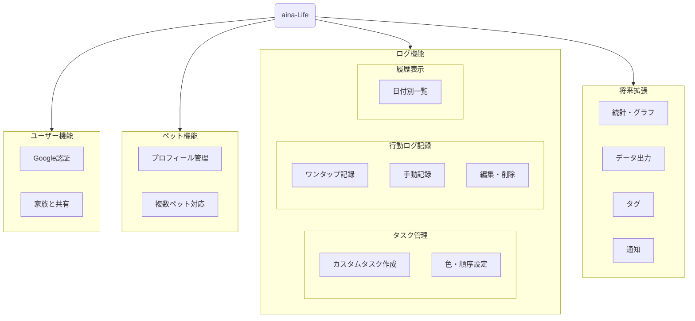

# aina-Life(犬ライフログアプリ) 要件定義書

## 1. 概要
犬の1日の行動を簡単に記録・管理するアプリ。  
- 分単位での時間入力  
- タスクボタンでリアルタイム記録  
- 日付切替・編集・削除可能  
- 複数犬・複数ユーザー対応  
- 認証・同期に対応  
- 分析・統計に対応  

---

## 2. 機能構成図

---

## 3. ユーザー要件
- Googleログインによる認証
- 複数ユーザーで同じ犬のログを共有できる
- 認証済みユーザー情報は必要（名前・メール・作成日）

---

## 3. 犬プロフィール要件
- 複数犬対応
- 犬ごとの情報：名前・犬種・誕生日

---

## 4. タスク要件
- 初期ボタン（削除可能）  
  - 寝た・起きた・ご飯・おやつ・遊び・散歩・うんち・おしっこ・お留守番・病院
- ユーザー追加タスク可能（追加・編集・削除）
- タスクの色分け・順序保持

---

## 5. 行動ログ要件
- ボタン押下でリアルタイム記録（日時＋タスク名）  
- 手入力も可能（時刻・タスク名）  
- 編集・削除可能  
- Undo機能で誤操作防止

---

## 6. 履歴表示要件
- 日付切替（矢印ボタン）で過去・未来の日付閲覧  
- ログ一覧表示  
- 編集・削除可能  

---

## 7. オフライン要件
- 圏外でもログ記録可能  
- 接続回復時に自動同期  
- (注: Firestoreのキャッシュ機能により実現)  

---

## 8. 将来拡張要件（オプション）
- 犬ごとの統計・グラフ表示  
- CSV/PDF出力  
- タグ機能（例：散歩朝/夜、ご飯ドッグフード/おやつ）  
- プッシュ通知（リマインダー）  